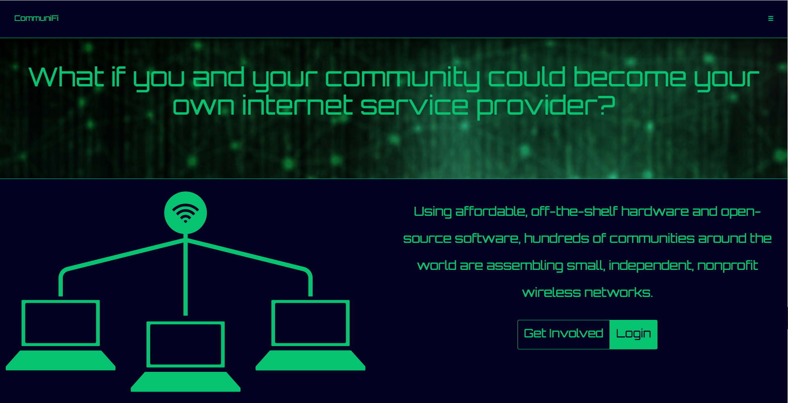
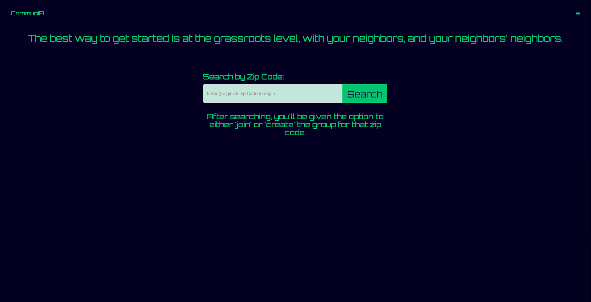
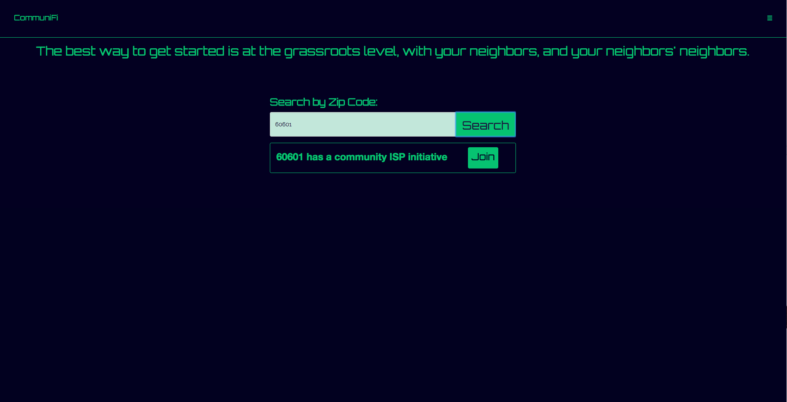
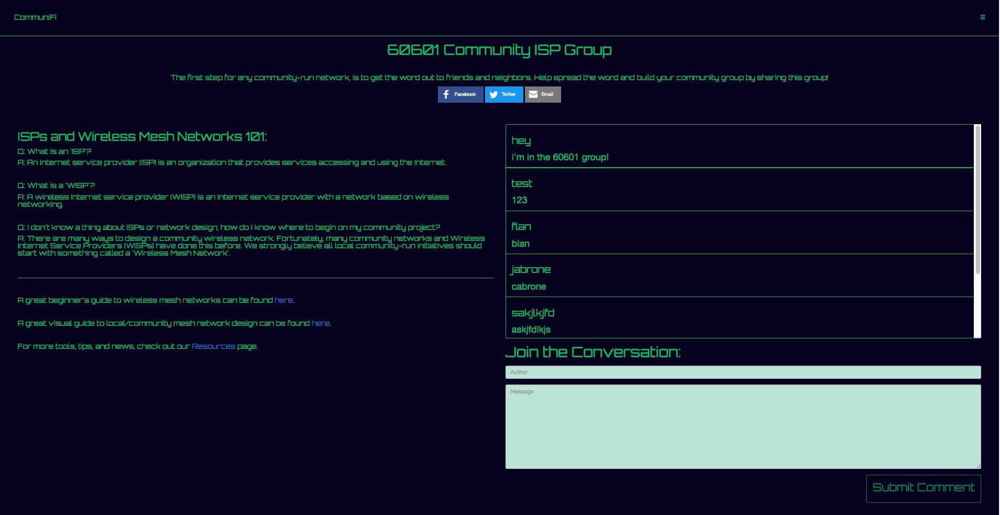
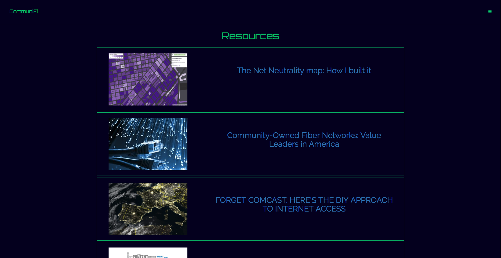
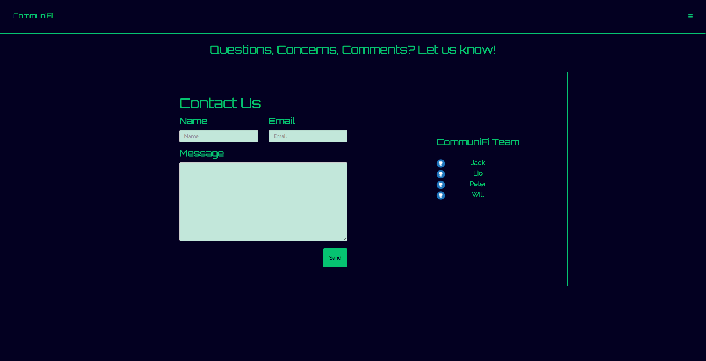

## 

A forum application built to foster local, community-run internet service initiatives. Built with the following technologies:

* [React](https://reactjs.org/)
* [ExpressJS](https://expressjs.com/)
* [PassportJS](https://www.passportjs.org/)
* [NodeJS](https://nodejs.org/)
* [MongoDB](https://www.mongodb.com/)
* [MongooseJS](https://mongoosejs.com/)

Application is deployed on Heroku. Check it out: <https://arcane-ridge-17845.herokuapp.com/>

***
###Application Features

* Users can search for community internet projects by US Zip Code
* If a project exists, users can join the forum for that project. If a project doesn't exist, users can start the forum for that Zip Code
* To promote their community-run internet project users can share the application and their forum via Facebook, Twitter, and email
* A resources page with helpful networking guides, tips, case-studies, and news articles
* A contact page for users to contact us via email

###Documentation

* [API Docs]()
* [System Overview]()

###Home View

###Search View

###Search Results View

###Forum View

###Resources View

###Contact View

***

###Deploy on your own server

Make sure you have the following software installed:

* Node.js
* NPM / Yarn
* Git
* MongoDB

First, we need to clone the repository:

	git clone git@github.com:wla312/ISPdeployment-test.git
	
Then, we have to install the necessary dependencies using Yarn:

From the project root:

	$ yarn install
	$ cd client
	$ yarn install
	$ cd ..
	
The project uses Google authentication, so we need to configure our application credentials with a Google account.

We need to grab the following information from the OAuth application.

* Client ID
* Client Secret
* Callback URL

The `Callback URL` is the domain where Heroku will redirect the user after a successful login. You can use a domain name or local host, but you will need to append the URL with the path.

Then, we need to configure the credentials inside the codebase. Open the file `services/passport-setup.js` and add the necessary information. 

Now we are ready to run the application. Run the application locally first.

In one bash terminal window:

	$ mongod
	
At the root of the project:

	$ yarn start
	
Because of the `package.json`, and `scripts/start-client` files, the application should automatically load in your browser window.

If for some reason it does not, check both `http://localhost:3000` and `http://localhost:3001` and your bash terminal for error messages.

###Path for future work

* Let users star/favorite discussion topics
* Add an additional layer to the forum
* Let users create and retain a brief user profile
* Refine login
* Admin layer
* Refine search functionality
* Add unit tests

###License

[ISC](https://opensource.org/licenses/ISC). Clone and modify as you wish!

###Conclusion

This application was created by:

* [Will](https://github.com/wla312)
* [Peter](https://github.com/plee1467)
* [Lio](https://github.com/liotovar)
* [Jack](https://github.com/JohnHillgard)

Any comments, pull requests, issues, or contributions are greatly appreciated.
	

